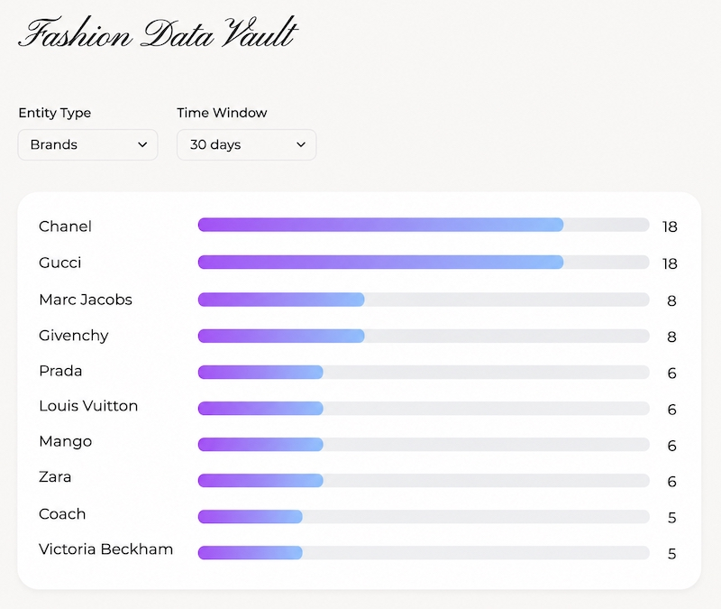

# Fashion Data Vault

A fashion trend intelligence platform that extracts trends, brands, materials, and seasons from 7000+ RSS feed entries across five leading fashion publications using a custom spaCy NLP pipeline.

_Website: [fashiondatavault.com](https://fashiondatavault.com)_

## Overview

Fashion Data Vault collects publicly available RSS feed data from five leading fashion publications and applies a custom spaCy NLP pipeline to extract trending items, materials, brands, and seasons. All data is sourced from publisher provided RSS feeds. No full article text is scraped or redistributed.

## Purpose

Fashion trend intelligence has historically been expensive, opaque, and available only to a handful of companies. As a result, many brands are making production decisions blindly, estimating what to make and how much of it. But it's not only brands who suffer, large retailers are still unable to correctly anticipate demand, leading to overpurchasing, excessive markdowns, and piles of unsold stock. These issues stem from a lack of access to information needed to understand how trends emerge and evolve. FDV is an attempt to make that information visible and accessible to anyone who needs it.

## Tech Stack

Backend: Python, psycopg3, spaCy, FastAPI  
Database: PostgreSQL, Neon  
Frontend: Next.js, TypeScript, Tailwind CSS  
Deployment: Railway, Vercel

## Architecture & Data Pipeline

## Technical Decisions

FDV is being developed in iterations, with each phase expanding the type of data sources that it ingests. Data collection follows an adapter based architecture to simplify the addition of new data sources as it progresses. In this version, FDV relies primarily on spaCy for NLP based trend extraction. However, spaCy's pretrained models (en_core_web_sm and en_core_web_md) proved limiting in terms of their fashion specific knowledge. As a result, a custom pipeline was built using manually curated datasets, rule based entity extraction, and spaCy's Matcher and Entity Ruler components. Without custom machine learning models or custom NER, this approach cannot achieve 100% accuracy. Nevertheless, it can provide meaningful insights into emerging trends.

## Roadmap

Phase 1 _(Current)_

- Aggregate publicly available fashion news via RSS feeds and apply custom NLP to perform entity extraction and trend analysis.

Phase 2

- Incorporate consumer search interest data and public social discussion signals.
- Track emerging topics and shifts in consumer interest over time.

Phase 3

- Use computer vision to analyze runway and social media imagery for color, silhouette, fabric, pattern, and design details.

Phase 4

- Develop custom machine learning models for trend prediction and forecasting.
- Perform time series analysis to identify emerging patterns.

## License

Copyright © 2026 Itzel Salazar. All rights reserved.
